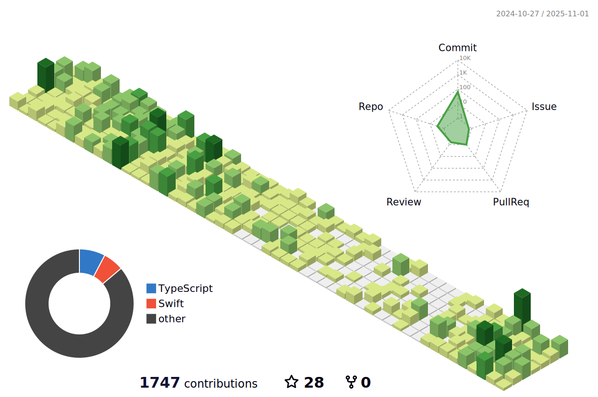

# Hi there, I'm Mohsen 👋

I'm a Mobile Development Lead and Backend Developer dedicated to building high-performance Android, iOS, and backend applications. I focus on delivering robust, scalable, and efficient solutions, whether creating immersive mobile experiences or architecting a powerful backend infrastructure.

---

### 🛠️ Technical Skills

| Area                   | Technologies                                                   |
|------------------------|----------------------------------------------------------------|
| **Mobile Development** | Android (Kotlin, Jetpack Compose), iOS (Swift, SwiftUI), Flutter |
| **Backend Development**| Node.js, NestJS, TypeORM, Firebase, SQL, NoSQL                 |
| **Architecture**       | Microservices, MVVM, MVI, Clean Architecture                   |
| **DevOps**             | Docker, Jenkins, GitLab CI, GCP                                |
| **Tools**              | Firebase, Google Cloud Platform, ARKit                         |

---

### 🚀 Current Projects

#### **Time-Tracking and Productivity App**
- **Backend**: NestJS, WebSocket integration for real-time tracking
- **Features**:
  - Role-based access control with Passport.js (ADMIN, MANAGER, EMPLOYEE, USER roles)
  - Real-time activity tracking, session management, and dynamic user settings
  - Reporting microservice utilizing shared library/package, JWT guards, and Docker Compose

#### **Crypto Arbitrage Detector**
- **Stack**: NestJS, Angular, Redis
- **Description**: A real-time crypto arbitrage detection tool with a 90% detection accuracy, providing users with timely alerts.

#### **Fog Computing Simulator**
- Developed a toolkit for **fog/edge computing** using Java and Kotlin, increasing simulation accuracy by 30% and reducing processing time by 25%.

---

### 🌱 Personal Projects

- **AirBox: Online Air Mail** – A cross-platform drone delivery app with real-time tracking and notifications.
- **Android Malware Detector** – Collaborated on a machine learning project, improving malware detection rates by 40%.
- **Yass Donation Apps** – Developed Android, iOS, and web donation apps using Flutter, RxDart, and Firebase.

---

### 📫 Connect with Me

- **Website**:[Mohsen Mokhtari](https://marsxan.github.io/mohsen/)
- **GitHub**: [@MarsXan](https://github.com/MarsXan)
- **LinkedIn**: [Mohsen Mokhtari](https://www.linkedin.com/in/mohsen-mokhtari)
- **Stack Overflow**: [Mohsen Mokhtari](https://stackoverflow.com/users/5892896/mohsen-mokhtari)

---
### 😎 My Contributions

Thanks for stopping by! Feel free to explore my repositories or connect for collaboration!
